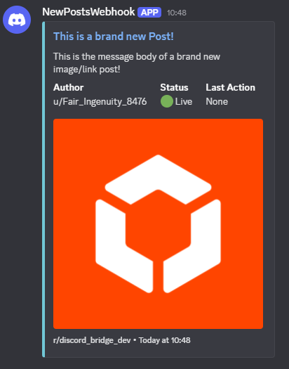
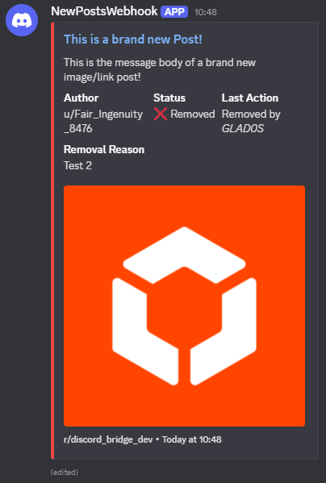
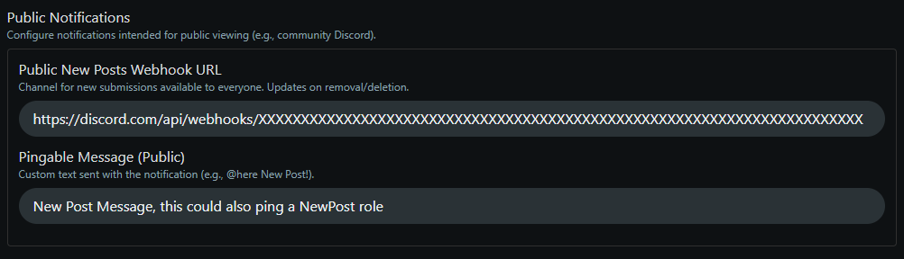
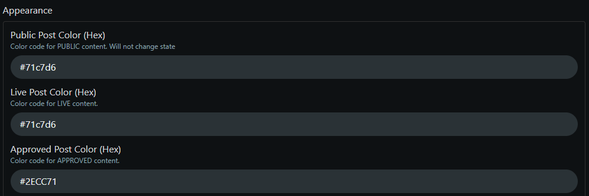
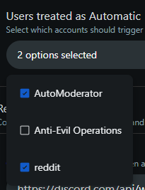
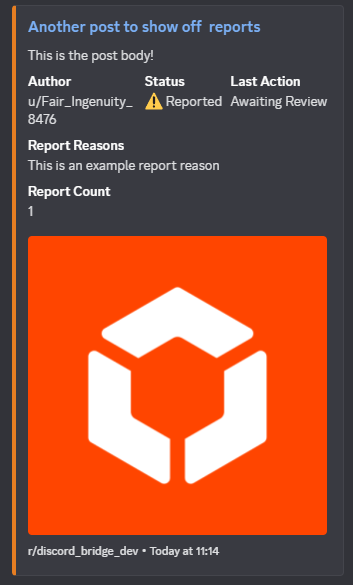
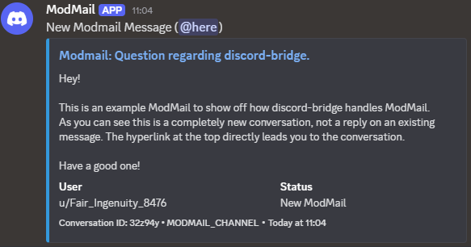
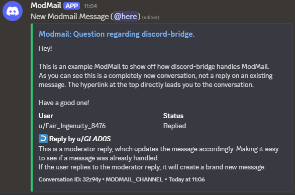
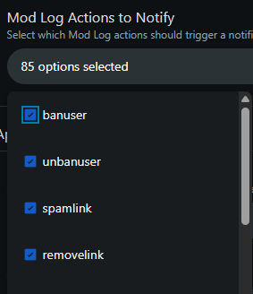

# Discord-Bridge

An app to help bridge the gap between reddit and discord. 
Making at easy to keep track of anything related to your subreddit directly from your discord server.

## Features

- Automatic notifications for a variety of events:
  - New posts
  - Removals, as well as why the removal occured
  - Spam removals
  - Reports
  - ModMail
  - ModLog

- State Aware Messages:
  - If a post is approved/removed/deleted or similar all messages related to the post or comment will update to reflect the current state
  - ModMail notifications will update when replied or when archived
  - This makes it not only easy, but also quick to see if anything requires your attention, or if another moderator already took care of it.

<table>
  <tr>
    <td align="center">
      
       
      <b>New Post Notification</b>
    </td>
    <td align="center">
      
       
      <b>The same Notification after it was removed</b>
    </td>
  </tr>
</table>

- Public New Post Feed:
  - This is a special new post feed that is designed to be viewed in public discord servers.
  - Unlike the other webhooks it will not share any moderation information, plus it will remove any post messages that are no longer public. (eg. removed by moderators, deleted by the user, or filtered by AutoModerator)

- Customizable Embed Colors
  - You can fully customize the colors for each message state

- Pingable Notification Text Fields
  - Each feed type has one or more notification fields, allowing you to ping a specific role or user when an event occurs.
	
- ModLog Notification Limiting
  - You can select which ModLog action can or cannot trigger a notification.
  - This way you can mute any that are less relevant, keeping only important notifications. 

- Removal Types
  - There are 3 different removal types, each with their own pingable notification field:
	- Moderator Removal
	- Automatic Removal (AutoModerator)
	- Admin Removal (Similar to AdminTattler)
	
## Setup and Configuration

- To learn how to create a webhook URL, check out the official [Intro to Webhooks (Discord Support)](https://support.discord.com/hc/en-us/articles/228383668-Intro-to-Webhooks)

- Any feature will only become active once a valid Discord webhook URL is provided for that feed type.
- Pingable notification messages are optional and can be left empty if not desired.

	

- Embed colors can be customized by providing a hex color code (eg. #FF0000 for red). If left empty a default color will be used.
- These colors represent the state of an item, for example a new post will use the "Approved" color, while a removed post will use the "Removed" color.

	

- Specific Feature Information:
	- Public New Posts
		- This feed is designed to be used in public discord servers.
		- Posts that are no longer public (removed, deleted, filtered) will have their messages deleted.
		- Posts that were automatically filtered or removed will not show up in this feed at all.
		- If a post becomes approved after being filtered or removed at any point, it will be sent again into the public channel.

	- Private New Posts
		- This feed is designed to be used in private moderator discord servers/channels.
		- All new posts will be sent here, regardless of their state.
		- If a post is later removed or deleted, the message will update to reflect that.
		- It also contains moderatory information, including last action performed on that item, who performed that action and any removal reason provided if one exists.
		- This feed is ideal for keeping track of all new posts and their current state.

	- Removals
		- This feed will notify you of any removals that occur in your subreddit.
		- It will specify the type of removal (Moderator, AutoModerator, Admin) as well as who performed the removal and any reason provided.
		- If a removal is later reversed (approved) the message will update to reflect that change.
		- Depending on which type of removal occured the message color as well as the pingable notification text will be chosen accordingly.
		- You can select which type of automated user is marked as "Automatic". So if you trust a removal by certain bots you can have them marked as moderator removals instead of automatic.

		

	- Reports
		- This feed will notify you of any reports that occur in your subreddit.
		- It will specify what was reported (post or comment) and the reason provided.
		- If the reported item is later removed or deleted, the message will update to reflect that change.
		- Each report will generate its own message, so multiple reports on the same item will create multiple notifications.

		

	- ModMail
		- This feed will notify you of any new ModMail conversations as well as replies to existing conversations.
		- It will specify who sent the message (user or moderator) and the content of the message.
		- If a conversation is archived, the message will update to reflect that change.
		- For simplicity and size reasons, only the latest message in a conversation will be shown in the notification.
	
	<table>
	  <tr>
		<td align="center">
		  
		   
		  <b>This is an example of a new ModMail Message</b>
		</td>
		<td align="center">
		  
		   
		  <b>It will also display a moderator reply and mark it as replied</b>
		</td>
	  </tr>
	</table>

	- ModLog
		- This feed will notify you of any ModLog actions that occur in your subreddit.
		- You can select which ModLog actions will trigger a notification, allowing you to mute less relevant actions.

		

## Information regarding deletions

- This app will respect deletions. This means that if a post that is being tracked is deleted, the corresponding message data in discord will be replaced.
- This includes the author of the post or comment, as well as the message body.
- To ensure no messages can be missed for any reason the app will delete sent messages after 13 days.

# This app is still in early development!

- It is likely that bugs or incorrectly identified events may occur.
- If you run into any issues feel free to let me know.
- The app will never perform any action on your subreddit, it is read-only by design.
